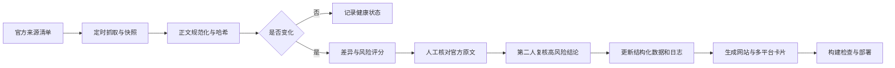

# qdd.app 长期改版与商业化路线图

> 决策日期：2026-08-13  
> 品牌：乔大帅｜中国护照出境说明书  
> 定位：面向中国普通护照持有人的出境决策与政策证据系统

## 一、执行摘要

qdd.app 不再以“做了多少国家攻略”为核心指标。真正可积累、可分发、可商业化的资产，是一套结构化且可审计的政策证据账本：每个结论都知道适用谁、适用什么目的、何时生效、官方页面何时更新、本站何时核验、下次何时复核，以及依据哪一段官方来源。

长期产品按五层建设：

1. 政策证据账本：结构化字段、官方来源、快照、版本、差异和审核记录。
2. 确定性决策工具：护照、居住地、目的、停留、行程段和既有签证共同参与判断。
3. 内容分发系统：国家页、专题页、卡片、公众号、小红书和 X 共用一份数据。
4. 用户提醒层：关注国家、出发日期、家庭多人清单；需求验证后才建账号。
5. 商业服务层：个人可更新清单、企业政策监测、结构化 API 与白标组件。

qdd.app 不声称替代使领馆、航空公司、边检或 IATA Timatic。差异化是中文解释、办理顺序、风险翻译、官方证据和出发前复核。

这次申请层升级把每个国家页的首要动作改成“打开官方入口”。签证、电子签、免签和入境卡分别记录申请入口、官方指南、官方材料、费用、处理时间、备选路径（如有）、资料清单、步骤、成功率出处和失败风险。

## 二、Kimi 素材如何纳入

Kimi 的线上核对报告作为纠错线索进入复核队列，不能直接成为 VERIFIED 数据。政策组已确认俄罗斯旧结论必须反转，并进一步发现 Kimi 所写的 2026-09-14 截止日也已过时：俄方后来把现行免签延长至 2027-12-31。

Kimi 提出的中亚丝路、高加索、非洲免签/eTA、巴尔干和微型国家合集，适合作为专题化扩张候选池。首批候选为哈萨克斯坦、乌兹别克斯坦、亚美尼亚、阿塞拜疆、摩洛哥、突尼斯、毛里求斯、塞舌尔、肯尼亚、塞尔维亚、波黑和阿尔巴尼亚。任何停留天数、费用、入境卡或生效状态，在取得官方一手来源前都不得发布。

政策组另确认柬埔寨、菲律宾、巴西的限时或窄条件免签线索已有一手依据。它们进入“已核验候选池”，后续页面必须配截止日、适用口岸/累计口径和自动终止预警，不能当永久免签宣传。

## 三、产品与信息架构

### 当前阶段已经实施

- 首页公开“核验期内 / 待复核”状态，不用一个全站最新日期掩盖逾期页面。
- 新建政策更新日志、核验方法、场景专题和机构需求页。
- 国家页显示复核状态、纠错入口和同类规则推荐。
- 搜索支持 `?q=` 回填、筛选和定位，和 SearchAction 声明闭环。
- sitemap 为国家页写各自真实的核验日期。
- ROADMAP 对近期变化国家改为“政策重核中”，不传播旧标签。

### 未来页面结构

国家页的标准顺序为：三秒结论 → 出发前清单 → 适用与不适用人群 → 办理或入境步骤 → 风险误区 → 结构化字段 → 变更记录 → 官方来源 → 情境相关推荐。

专题页不做国家链接堆砌。每页先解释共同规则，再列差异：免签、需要签证、入境卡、申根第一次、家庭多人、复杂转机、临时政策倒计时。只有搜索意图独立且能提供增量价值时才建页，避免批量薄内容。

### 暂不建设

AI 聊天机器人、App、社区、积分、会员徽章、3D 地图、多语言、泛酒店机票内容和“实时通过率”。规则库与审核链没有成熟前，AI 问答会放大错误；回访需求没有验证前，账号系统只会增加成本。

## 四、政策数据模型 v2

每条规则至少包含：适用护照、居住地/领区、出发地、目的、单次与累计停留、签证/入境卡、费用、处理时间、政策生效日、官方页面日、本站核验日、下次复核日、截止日、官方链接、原文摘要、风险等级、审核人和版本。

状态机建议：

- `current`：仍在计划复核周期内。
- `due`：复核日已到，结论未证明失效，但必须公开提示。
- `changed`：来源差异已确认，旧结论停止作为当前答案。
- `reviewing`：变化存在但适用范围尚未核清。
- `expired`：限时政策到期，自动切回预先准备的回退路径或阻断发布。

## 五、自动更新架构

仓库已经加入第一版来源注册表与本地差异扫描脚本。它只发现变化、写快照和排队，不自动改政策。第二阶段迁移为 Cloudflare Cron + D1：Cron 调度，D1 保存快照、差异、审核状态和订阅目标；高风险结论仍必须人工复核。

更新 SLA 建议：美国、韩国、日本、泰国以及所有有截止日的临时政策每周扫描；其余每月。截止日前 30/14/7 天触发终止预警。核心质量指标是关键结论官方来源覆盖率 100%、逾期页不伪装成已核验、重大变化发现到人工判断的时间，以及纠错关闭时间。

申请入口的更新闸门单独计算：入口 URL、材料清单、费用页、时效页和成功率统计页任何一项发生变化，都先标记 `application_reviewing`；自动化不能只因为 HTTP 200 就宣布“可申请”。政府站点的 403、验证码、地区跳转和动态登录页都要进入人工确认。

## 六、客户与获客

C 端核心用户：第一次出国者、家庭多人出行、复杂转机/多国行程、临近出发需复核者。免费价值是“30 秒结论 + 官方出处 + 核验日期”；付费价值只能是节省核验和整理时间，不能是提高获签率。

B 端优先对象：企业行政/HR/差旅负责人、会展与研学机构、具备资质的旅行社/TMC、保险/eSIM/航旅产品和内容团队。先访谈 10 位目标负责人，寻找设计合作伙伴，不先买量。

获客飞轮：官方变化 → 人工核验 → 国家页和更新日志 → 公众号周报 → 小红书 5–8 张卡 → 可分享结论 → 用户纠错与关注登记 → 反哺复核队列。各渠道使用 UTM，衡量搜索到国家页、专题到国家页、官方来源点击、纠错/关注邮件和有效访谈，不以 PV 为唯一目标。

## 七、盈利路线与商业红线

### 收入阶梯

1. 免费政策页和更新日志建立信任。
2. 可更新出境清单、家庭多人差异报告等低客单成果。
3. 有明确边界的人工公开政策核验，不代办、不预测审核结果。
4. 企业政策监测、内部简报、API 和白标组件。
5. eSIM、保险等联盟合作必须显著标注广告/佣金，且不得影响结论和排序。

价格只作为实验假设，不在当前网站冒充已开通服务：单次清单 9.9/19.9/29.9 元；家庭报告 49/79/99 元；具备主体、SOP、退款机制后再测试人工核验 99–199 元；B 端设计伙伴期 999–1999 元/月。只有真实访谈、LOI 或付费试点能验证价格。

本次只上线三类真实入口：政策变动内测邮件登记、企业政策订阅需求邮件登记、纠错邮件。不得显示购买、立即开通、已有客户、响应时效或虚构订阅成功。

没有相应资质时，不代办签证、约号、填表、代收证件或销售出境行程组合；不收护照扫描件、身份证、银行流水、雇主信和生物信息。未来若收费，必须先完善经营主体、服务边界、价格、交付、退款、投诉、隐私与发票机制。

## 八、12 个月验证路线

| 时间 | 核心任务 | 通过闸门 |
|---|---|---|
| 0–2 月 | 信任层、三类邮件入口、20 次 C 端与 10 次 B 端访谈 | 有效登记 ≥100；目标国家关注率 ≥5%；企业有效线索 ≥10 |
| 3–4 月 | Concierge 方式交付清单和家庭样本 | ≥20 次完整交付；愿付费率 ≥20%；支持中位数 ≤20 分钟 |
| 5–6 月 | 主体、支付、合同、退款、发票完成后做 50–100 单实验 | 个人数字产品贡献毛利 ≥80%；人工服务 ≥50%；至少 1 个 B 端付费 PO/LOI |
| 7–9 月 | B 端监测仪表盘/邮件周报 MVP | 3–5 家付费试点；至少 3 家中 2 家有续约意向 |
| 10–12 月 | 达标后扩至 30–40 个高频国家，验证白标/API | B 端毛利 ≥70%；CAC 回收 <6 月；续约意向 ≥67% |

若闸门不达标，保留高质量免费内容站与线索业务，不强行做会员。

## 九、90 天执行清单

- Day 0–14：完成可信状态、俄罗斯纠错、更新日志、方法论、专题入口、搜索与 sitemap 修复。
- Day 15–30：补出发前清单与情境内链，发布首批三专题；观察专题到国家页点击、零结果率和官方来源动作。
- Day 31–60：每周生成一次政策变化母内容，拆为公众号与小红书；建立渠道 UTM 和回访基线。
- Day 61–90：完成 20 个 C 端和 10 个 B 端访谈；只有合格访客提醒意向 ≥3%、至少 5 位用户愿为明确交付付费、至少 2 家 B 端愿试点，才进入账号与支付设计。

北极星指标为 Qualified Policy Session：用户完成至少一个高意图动作，例如点击官方来源、提交纠错、分享页面或登记关注国家；内容新鲜度与政策准确性是独立的硬门槛，不能被增长指标覆盖。

## 十、官方与行业参照

- IATA Timatic：<https://www.iata.org/en/services/compliance/timatic/>
- Google people-first 内容：<https://developers.google.com/search/docs/fundamentals/creating-helpful-content>
- Cloudflare Cron：<https://developers.cloudflare.com/workers/configuration/cron-triggers/>
- Cloudflare D1：<https://developers.cloudflare.com/d1/>
- 《旅行社条例实施细则》：<https://lyfw.mct.gov.cn/site/special/details?id=1597>
- 《个人信息保护法》：<https://www.npc.gov.cn/npc/c2/c30834/202108/t20210820_313088.html>
- 《互联网广告可识别性执法指南》：<https://www.samr.gov.cn/ggjgs/tzgg/art/2024/art_fb2f2f9b53f04dc294df2105b2e050a0.html>

本文件由产品增长、政策事实、商业风险三组独立评审后综合；Kimi 内容作为选题和纠错线索吸收，未经一手来源复核的结论未进入正式政策库。
